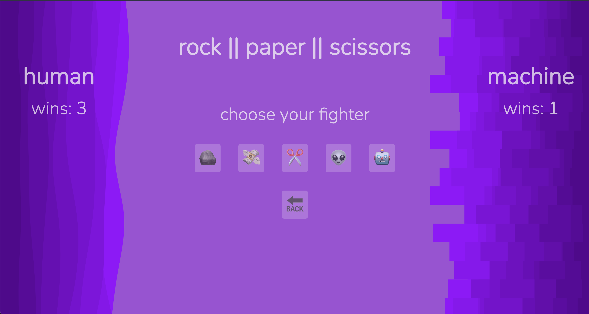

   # Self-Care Center 

### Abstract:
[//]: <> (Briefly describe what you built and its features. What problem is the app solving? How does this application solve that problem?)

The application is a Rock-Paper-Scissors game featuring two modes. The game is set up to be played against a computer that generates random choices against the user. It provides an interactive and entertaining experience, offering an extended set of choices in the Extreme mode.

### Installation Instructions:
[//]: <> (What steps does a person have to take to get your app cloned down and running?)
GitHub!

### Preview of App:
[//]: <> (Provide ONE gif or screenshot of your application - choose the "coolest" piece of functionality to show off.)

### Context:
[//]: <> (Give some context for the project here. How long did you have to work on it? How far into the Turing program are you?)

We received this assignment on Tuesday 11/7 and it was due Tuesday 11/14. We are 5 weeks into the Turing program.

### Contributors:
[//]: <> (Who worked on this application? Link to their GitHubs.)

Laura Long [GitHub](https://github.com/lalonggone)

### Learning Goals:
[//]: <> (What were the learning goals of this project? What tech did you work with?)

- Gain experience building an application that utilizes HTML, CSS and JavaScript
- Commits are atomic and frequent, effectively documenting the evolution/progression of the application
- Developer uses PRs from feature branches before adding new code to the main branch.
- The README is formatted well and gives new contributors and employers sufficient context about the project:

### Wins + Challenges:
[//]: <> (What are 2-3 wins you have from this project? What were some challenges you faced - and how did you get over them?)

This project was fun and challenging. Building the HTML and CSS felt pretty smooth. The JavaScript took some time for me but I feel good about it and understand what it's doing. I should have been making more frequent commits, at the end of every day instead of waiting after writting a whole bunch of code. DOM manipulation is hard not to mess with before / during updating the Data Model, but I did it for the most part! I practiced console logging more often. I'm not sure if the Classic Mode and Extreme mode need to have separate functions for everything, but it seemed to be the only way I could get it to work. I also couldn't get the timeout un the update scored function to work, so I left it out for now. 